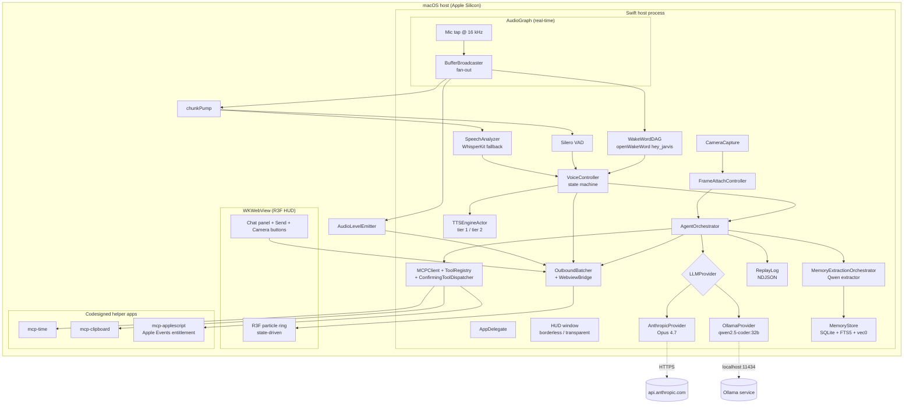

# Architecture

Current architecture of the Jarvis macOS assistant, reflecting the post-audit-2026-05-04 state of `develop`. Treat this as load-bearing — future contributors (and future me) read this to understand the system.

## Overview

Jarvis is a personal, always-on macOS assistant for a single user on a single Apple Silicon machine. It exists to put a Claude-powered agent loop, voice I/O, and a cinematic R3F HUD behind a global hotkey, with deep-OS integration that browsers can't have (mic, camera, calendar, clipboard, AppleScript). The constraint set rules the design:

- **Personal use only** — no auth, no multi-tenant, no SaaS plumbing. One database, one config tree, one keychain.
- **macOS-only, Apple Silicon target** — `LSMinimumSystemVersion` is macOS 26 Tahoe; MLX, SpeechAnalyzer, and on-device speech assets are all Apple Silicon paths.
- **On-device wherever practical** — voice (STT + TTS), memory extraction, embeddings, and vision T1 routing all run locally. The only network hop is to Anthropic's Messages API for the primary LLM (cloud-escape T3 vision routing falls back to Anthropic too). Memory data never leaves the machine.

The shape is a hybrid native + embedded-web app:

- **Swift host (`App/`)** owns the agent orchestrator, voice/vision/memory subsystems, MCP tool runtime, persistent storage, hotkeys, menu bar, and the borderless transparent HUD window.
- **WKWebView** hosts a React + React Three Fiber bundle (`webview/packages/hud`) that renders only — particle ring, chat panel, camera button, debug overlay.
- **Bidirectional Bus** (`packages/Bus`) carries typed JSON over `WKScriptMessageHandler`. Swift holds all truth; the webview reflects it.

## Why this architecture (locked decisions)

These are settled per [`CLAUDE.md`](CLAUDE.md). Don't relitigate without specific cause.

**Native Swift + WKWebView (not Tauri, not Electron).**
Apple's on-device ML stack — `SpeechAnalyzer`, `AVSpeechSynthesizer`, Vision, Core ML, MLX — is native-only. Menu-bar apps and global hotkeys require AppKit. Browsers are sandboxed: no calendar, no clipboard, no always-on mic. SwiftUI alone can't match the WebGL/R3F ecosystem for particle/shader-heavy HUDs, so the rendering layer is web. Tauri is the only acceptable fallback if WKWebView proves untenable; Electron is not preferred.

**Claude Opus 4.7 primary, Ollama first-class.**
The orchestrator talks to an `LLMProvider` protocol returning `AsyncThrowingStream<LLMEvent, Error>`. `AnthropicProvider` and `OllamaProvider` both conform; swapping is a config toggle. Cheap/private/offline work (memory extraction, embeddings) routes to local Ollama by design — never to Anthropic.

**MCP for tools.**
Tools ride on the official Model Context Protocol Swift SDK (`modelcontextprotocol/swift-sdk v0.12.0`). Each helper is a separately codesigned nested `.app` bundle under `Contents/Helpers/<Name>.app/` with its own `Info.plist`, entitlements, and TCC identity. Only `mcp-applescript` holds `com.apple.security.automation.apple-events`. The host spawns helpers through `ChildSpawnGate` which enforces `FD_CLOEXEC` and a minimal environment.

**Local-only voice.**
No cloud STT/TTS. Wake word: openWakeWord `hey_jarvis` via ONNX Runtime Swift. VAD: Silero v6.2.1. STT: macOS 26 `SpeechAnalyzer` primary, WhisperKit fallback. TTS tier 1: `AVSpeechSynthesizer` (instant, mediocre). TTS tier 2: Orpheus via `mlx-audio-swift` (deferred — weights download outstanding). The "no streaming" constraint meant "no cloud streaming"; on-device streaming TTS is allowed.

**SQLite + sqlite-vec for memory.**
Single file at `~/Library/Application Support/Jarvis/jarvis.db`. FTS5 for keyword + sqlite-vec for vector search; Reciprocal Rank Fusion for hybrid. Embeddings via `nomic-embed-text` on Ollama. Extraction follows the mem0 ADD/UPDATE/NOOP pattern via Qwen 2.5-Coder 32B. Temporal validity (`valid_from`/`valid_to`) preserves history without delete. **Functionally OFF until `vec0.dylib` ships and Ollama models are pulled** (Track D-5/D-6/D-7 — user environment work).

## Top-level flow

The Bus is bidirectional: Swift→JS carries `hudState`, `tokenDelta`, `audioLevel`, `toolCallStart/End`, `turnStarted/Ended`, `sessionHistory`. JS→Swift carries `helloAck`, `uiReady`, `frameAttachRequested`, `chatSubmit`, `chatCancelAndSubmit`. Schema is hand-written `Codable` on both sides to prevent drift; `scripts/check-bus-protocol-version.sh` enforces version sync between TS and Swift.

## Subsystem deep-dives

### Voice (`packages/Voice`)

State machine + audio plumbing. `VoiceController` (actor) is the top-level state holder: `idle → listening → thinking → speaking`. It owns `AudioGraphOwner` (lifecycle of `AVAudioEngine` with the canonical six-step teardown for VOICE-10 four-trigger uniformity), `BufferBroadcaster` (multi-consumer fan-out — Track B-7 fix; never read from `RingBuffer` directly outside the Voice package), `WakeWordDAG` (mel ring → embedding ring → classifier with 4-frame hysteresis), Silero VAD (gates STT session end on `.speechEnd` + 5-chunk hangover), STT (`SpeechAnalyzer` primary, `WhisperKit` fallback), and `TTSEngineActor` (tier-1 `AVSpeechSynthesizer`; tier-2 Orpheus deferred). VOICE-14 single `cancelAndSubmit` call site is grep-gated. T-06-05-03 forbids logging transcript text. T-06-05-02 routes the AEC banner through native AppKit, never a webview modal.

**Public surface used by App/:** `VoiceController`, `AudioGraphOwner`, `MuteWakeWord`, `PushToTalk`. **Depends on:** `AgentCore` (LLMEvent types), `Bus`, `Logging`, `Config`. **Used by:** `App/AppDelegate`, `App/Voice/*Adapter.swift`.

### Vision (`packages/Vision`)

Camera capture + presence detection + frame-attach to a turn. `CameraCapture` (actor) owns the `AVCaptureSession`, exposes `captureFrame()` for one-shot stills (returns JPEG bytes via `AVCapturePhotoOutput` delegate) and `frameStream(forPresence:)` for the fan-out used by `PresenceMonitor`. `FrameAttachController` (actor) is the single ingest path for arming a frame on the next turn — reachable from either the chat-input phrase trigger or the HUD camera button (`BusInbound.frameAttachRequested`). `discardFrame()` is the **sole emission site** for clearing the pending frame slot (D-15, grep-gated by `FrameAttachDiscardSiteGrepTests`). `VisionRouter` picks T1 (Ollama) / T2 (vllm-mlx, currently `MissingT2Provider` until sidecar lands) / T3 (Anthropic cloud-escape) based on heuristics. `MissingT2Provider` is intentional: explicit-missing surfaces the unwired sidecar instead of silently falling back to T1.

**Public surface used by App/:** `CameraCapture`, `FrameAttachController`, `PresenceMonitor`, `VisionRouter`. **Depends on:** `AgentCore`, `MCP` (`JarvisChildSpawn`), `Logging`. **Used by:** `App/AppDelegate`, `App/Vision/*`.

### Memory (`packages/Memory`)

Long-term fact store + extraction. `MemoryStore` (actor) is the only writer of `jarvis.db`; opens SQLite with WAL, loads `vec0.dylib` from the bundle via direct C API at construction time, runs schema migrations. `MemoryExtractionOrchestrator` (actor) drains a bounded `BoundedAsyncChannel<ExtractionJob>(capacity: 32, policy: .dropOldest)` on a serial Task; for each turn it calls `MemoryExtractor` (Qwen 2.5-Coder via Ollama) which emits ADD / UPDATE(supersedes:) / NOOP ops keyed against `priorFacts` from `MemoryStore.recentActiveFacts(limit: 50)` (D-3 — fixed the `priorFacts: []` hardcode). `HybridSearch` (actor) drives the FTS5 + vec0 RRF SQL and emits exactly one `ReplayEvent.memoryRetrieval` per fact through `MemoryStore.recordRetrieval` (D-05 single-emission grep gate).

**Caveat:** memory is functionally OFF until `vec0.dylib` ships (D-5/D-6) and Ollama models are pulled (D-7). `installMemory` degrades gracefully — extractor + orchestrator + coordinator construct even if `MemoryStore` init throws; writes log a warning, search disables.

**Public surface used by App/:** `MemoryStore`, `MemoryExtractionOrchestrator`, `MemoryExtractionCoordinator`, `HybridSearch`. **Depends on:** `AgentCore`, `Replay`, `Logging`. **Used by:** `App/AppDelegate`, `App/MCP/InProcessMemoryAdapters.swift`.

### Agent core (`packages/AgentCore`)

The orchestrator + provider implementations. Four library products: `AgentCore` (shared types — `LLMProvider`, `LLMEvent`, `LLMMessage`, `ToolSchema`, `ToolChoice`, `ImageBlock`, `ModelID`, `TurnID`, `TurnNonce`, `CacheHints`, `UntrustedWrapper`, `ToolResultPacker` with the 8 KB cap), `AnthropicProvider` (Opus 4.7 streaming SSE — handles `content_block_start`/`input_json_delta` for tool args, `thinking_delta`, `stop_reason: refusal`, `partial_tool_use_at_disconnect`), `OllamaProvider` (separate decoders for `/api/chat` NDJSON and `/v1/chat/completions` SSE — the NDJSON path reads `tool_calls` whenever seen, never gates on `done`), and `AgentOrchestrator` (the actor that runs the turn loop, dispatches tool uses, handles cap-recovery with `toolChoice: .none`, and 1-shot retries `streamTruncated`).

**SEC-06 invariant:** `TurnNonce` never appears on the bus or in any `OrchestratorEvent`; only the model-facing prompt and the replay log row see it.

**Public surface used by App/:** `AgentOrchestrator`, `LLMProvider`, `AnthropicProvider`, `OllamaProvider`, `ProviderSelection`. **Depends on:** `Keychain`, `Replay`, `Vision`, `Logging`, `Config`. **Used by:** `App/AppDelegate`, `App/Voice/VoiceOrchestratorAdapter.swift`, every other subsystem.

### MCP (`packages/MCP`)

Tool dispatch + child-process spawning. Two library products: `JarvisMCP` (the dispatcher chain — `MCPClient` actor manages registry of `MCPServerHandle`s with per-server restart mutex; `ToolRegistry` carries metadata; `MCPToolDispatcher` is the inner; `ConfirmingToolDispatcher` is the outer, gating `requiresConfirmation: true` tools through `ConfirmationBroker`/`ConfirmationPresenter`; `SanitizeForModel` runs `UntrustedWrapper` over tool results) and `JarvisChildSpawn` (`ChildSpawnGate` enforces `FD_CLOEXEC` + minimal `PATH` env on every helper spawn). In-process tools live under `Sources/MCP/InProcess/` and ride a separate `InProcessToolRegistry` — `SearchMemoryTool` + `ForgetFactTool` (Track D-2, store-/search-availability gated), the four Phase 10 / Wave-1 self-knowledge tools `ListAudioDevicesTool` / `GetActiveAudioRouteTool` / `GetSelfStateTool` / `ListCameraDevicesTool` (`74b9ac2`, all read-only, no confirmation), and the unwired `SearchConversationTool` (code-present; not yet registered in `App/`).

**Anti-pattern enforced:** `requiresConfirmation: true` for `run_applescript` is grep-gated at two sites (`scripts/check-applescript-confirmation.sh`).

**Public surface used by App/:** `MCPClient`, `ToolRegistry`, `MCPRuntimeWiring.build`, `ChildSpawnGate`. **Depends on:** `swift-sdk` (the official MCP SDK), `AgentCore`, `Logging`. **Used by:** `App/MCP/MCPRuntimeWiring.swift`, `App/AppDelegate`.

### Bus (`packages/Bus`)

The Swift↔JS protocol. `BusOutbound` enum cases mirror the TS union in `webview/packages/bus`; both sides hand-write `Codable`/JSON encode/decode (Swift's synthesized `Codable` would produce `{"hudState": {"_0": "idle"}}` instead of `{"type":"hudState","state":"idle"}`). `OutboundBatcher` (actor) coalesces `tokenDelta` events on a 32 ms tick and forwards everything else immediately. `WebviewBridge` is the `WKScriptMessageHandler` boundary. Schema version lives in `Protocol.swift` and the TS side at `webview/packages/bus/src/version.ts`; `scripts/check-bus-protocol-version.sh` requires both to match. `scripts/check-bus-harness-parity.sh` requires the harness fixtures to round-trip.

**Public surface used by App/:** `OutboundBatcher`, `WebviewBridge`, `BusOutbound`, `BusInbound`. **Depends on:** `Logging`. **Used by:** every subsystem that emits to the HUD.

### Webview / HUD (`packages/Webview` + `webview/`)

`packages/Webview` (Swift) loads `Resources/webview/index.html` from the bundle into the WKWebView with Hardened-Runtime `allow-jit` enabled. `webview/packages/bus` is the TS mirror of the Bus protocol (zod schema + parser). `webview/packages/hud` is the React + R3F bundle: `App.tsx` mounts the particle ring (`hud/`), the chat panel (`chat/` — `MessageList`, `ChatInput`, `CameraButton`), and the type-mirrored bus (`bus/`). State is reactive: `idle` ring drifts, `listening` ring pulses on RMS, `thinking` ring rotates, `speaking` ring glows. Vitest covers component logic; `scripts/smoke-test-hud.sh` exercises a load-bearing render against a fixture bus.

### Shell (`packages/Shell`)

OS-touch primitives. `HotkeyBinder` wraps `NSEvent.addGlobalMonitorForEvents` (preferred over Carbon `RegisterEventHotKey` per CLAUDE.md hotkey hygiene). `InputMonitoringProbe` calls `IOHIDRequestAccess(kIOHIDRequestTypeListenEvent)` to detect the silent-no-op TCC denial case and surfaces a HUD banner + System Settings deep link via `TCCAlertService`. `KeyboardShortcut` is the typed shortcut model; `ShortcutRecorder/` is the SwiftUI first-launch shortcut binder (Cmd+Shift+J / Option+Space collide with common apps, so the shortcut ships unset). `LaunchAtLoginController` wraps `SMAppService.mainApp`.

### Replay (`packages/Replay`)

Per-turn NDJSON log under `~/Library/Application Support/Jarvis/replay/`. `ReplayLog` (actor) is the single writer; events include `turnStart` (with `TurnNonce`), `userInput`, `tokenDelta`, `toolCallRequested`, `toolResult` (pre- and post-sanitize bytes both, per SEC-07), `memoryRetrieval`, `memoryFactAdded/Updated/Forgotten`, `turnEnd`. Promotion to a "session" replay file happens via `scripts/promote-replay-session.sh`. The replayer is a developer tool, not user-facing.

### Keychain (`packages/Keychain`)

Thin actor wrapper over `SecItem` for the Anthropic API key (and any future secret). `KeychainStore` is the protocol; `SystemKeychainStore` is production; `FakeKeychain` (in-memory) is the test fake. `AnthropicAPIKeyProvider.make` propagates `KeychainError` through the construction chain rather than swallowing — Track A fix.

### Config (`packages/Config`)

Two-tier config snapshot model: `LaunchSnapshot` (read once at startup — provider selection, feature flags, logging level) and `PerTurnSnapshot` (read at the start of every turn — TTS config, STT config, AppleScript policy, confirmation policy, Ollama config). `ConfigLoader` reads/writes JSON under `~/Library/Application Support/Jarvis/`. `SchemaMigrator` handles backward compat. Trivial prefs go to `UserDefaults`; secrets go to Keychain.

### Logging (`packages/Logging` → product `JarvisLogging`)

Channel taxonomy via `JarvisLogChannel` enum: `agent`, `tools`, `ui`, `system`, plus subsystem-specific (`voice`, `vision`, `memory`, `bus`). `LoggingBootstrap` wires `swift-log` to `OSLogHandler` (default) with a `FileLogHandler` rotation tier. `Redact` is the helper for masking secrets — used by every subsystem's `logger.debug` call sites. `LogPaths` resolves `~/Library/Application Support/Jarvis/logs/`.

## Cross-cutting concerns

### Concurrency

Swift 6 strict concurrency. Every actor has explicit isolation; cross-actor calls go through `await` setters (e.g., `AudioGraphOwner.setCancelInFlight` / `setReleaseORTSessions` from Track B-4). `Sendable` is enforced everywhere; `@unchecked Sendable` is reserved for `OSAllocatedUnfairLock`-protected mutable state with documented locking discipline (see `BufferBroadcaster`). The Core Audio tap thread is real-time; `BufferBroadcaster.publish` MUST be lock-free or use a wait-free `OSAllocatedUnfairLock` snapshot pattern — no actor hops, no Foundation locks.

### TCC + entitlements

Permissions surface incrementally as features are exercised:

| Permission | Triggered by | Info.plist key | Entitlement |
|------------|--------------|----------------|-------------|
| Microphone | First voice loop start | `NSMicrophoneUsageDescription` | — |
| Camera | First `CameraCapture.open()` | `NSCameraUsageDescription` | — |
| Speech recognition assets | First SpeechAnalyzer use | `NSSpeechRecognitionAssetsUsageDescription` | `com.apple.developer.speech-recognition-assets` |
| Apple Events (per target) | First `mcp-applescript` call | `NSAppleEventsUsageDescription` | `com.apple.security.automation.apple-events` (helper only) |
| Input Monitoring | Global hotkey `keyDown` | (manual) | (silent-no-op fallback path probed via `IOHIDRequestAccess`) |
| JIT | WKWebView JavaScriptCore | — | `com.apple.security.cs.allow-jit` (Apple Silicon Hardened Runtime) |

`scripts/verify-entitlements.sh --pre-codesign|--post-codesign` runs as Xcode build phases. Bidirectional REQUIRED + FORBIDDEN entitlement assertion is the single biggest force-multiplier in the project — listed by the security audit as the most preserved invariant.

### Codesign topology

Inside-out signing: deepest helper first (`mcp-applescript.app`, `mcp-clipboard.app`, `mcp-time.app` under `Contents/Helpers/`), main app last. **Never `--deep`** — re-signs nested helpers with parent identity, stripping per-helper entitlements. **Never Xcode "Code Sign On Copy"** on nested executables for the same reason. `scripts/codesign.sh` is the production path; `scripts/verify-codesign-settings.sh` is the static check.

### Boundary gates

18 grep-based architectural-invariant linters under `scripts/check-*.sh`. They are fast, deterministic, and run before push. Each enforces one rule:

| Gate | Enforces |
|------|----------|
| `check-app-builds.sh` | `xcodebuild build -configuration Debug` clean |
| `check-applescript-confirmation.sh` | `requiresConfirmation: true` at every `run_applescript` registration site |
| `check-bus-harness-parity.sh` | TS bus fixtures round-trip through the Swift decoder |
| `check-bus-protocol-version.sh` | `BusOutbound` Swift version == TS `bus/src/version.ts` |
| `check-corpus-secrets.sh` | No raw API keys / secrets in `.planning/evals/` corpus |
| `check-embedding-dim-literal.sh` | `768` dim is sourced from `Memory/Constants.swift`, not hand-typed |
| `check-install-order.sh` | `AppDelegate` install order matches the dependency graph |
| `check-no-evaluate-javascript.sh` | No `WKWebView.evaluateJavaScript` outside `WebviewBridge` |
| `check-no-leftover-stubs.sh` | No `Replaced in 0X-…` markers, `Noop*` instantiations, 2-line stub bodies |
| `check-no-modal-presentation.sh` | No `NSPanel`/`NSAlert` modal presentations from voice/vision (T-06-05-02) |
| `check-no-null-voice-adapters.sh` | `Null{Orchestrator,TTS,BusEmitter}Adapter` stay deleted |
| `check-orchestrator-events-single-consumer.sh` | One subscriber to `OrchestratorEvent` stream |
| `check-presence-bus-no-tts-orchestrator.sh` | Presence bus doesn't reach TTS or orchestrator directly |
| `check-presence-vision-isolation.sh` / `check-vision-isolation.sh` | Vision package boundary (no upward leaks) |
| `check-single-memory-mutated-emit.sh` / `check-single-memory-used-emit.sh` | Single-emission site for memory replay events |
| `check-single-writer-hudstate.sh` | Single writer to HUD state |

Run individually or as a sweep: `for s in scripts/check-*.sh; do bash "$s" || break; done`.

### Replay log + dev overlay

Every turn writes a full NDJSON log of LLM events, tool calls, sanitize pre/post bytes, and memory mutations. `DevOverlay` (Cmd+Option+D toggle) shows current agent state, last 5 tool calls, context token count, and per-turn latency breakdown. Together they're the primary debugging tools — when a turn fails, replay log gets attached to the bug.

## Anti-patterns (lessons from audits)

These are the rules with teeth — most are grep-gated. Don't relax them without coordination.

- **Single `cancelAndSubmit` call site (VOICE-14).** Only `VoiceController.bargeIn()` may call `orchestrator.cancelAndSubmit`. Grep-gated.
- **Never log voice transcript text (T-06-05-03).** No `logger.debug("transcript: \(text)")` anywhere in Voice or Memory.
- **AEC banner via native AppKit (T-06-05-02).** No `NSAlert` modal from voice paths; route through `VoiceBannerInterface` → `HUDBannerCoordinator`.
- **Wake-word DAG cancellation through `AudioGraphOwner.setCancelInFlight` (VOICE-10).** Single slot; called by all four rebuild triggers.
- **Multi-consumer audio: `BufferBroadcaster.subscribe()`, never raw `RingBuffer` (Track B-7).** Each consumer gets its own per-subscriber ring; reads stay SPSC.
- **Tool result content capped at 8 KB before reaching the model.** `ToolResultPacker` enforces; full bytes still go to replay (SEC-07). Opus 4.7 footgun: new tokenizer is ~35% more verbose than 3.x.
- **Cache hints gated on prompts ≥1024 tokens.** `CacheHints.eligibleForSystemPrompt`. Sub-threshold prompts silently ignore `cache_control` (Track A streamTruncated root cause).
- **`extended-cache-ttl` requires `anthropic-beta: extended-cache-ttl-2025-04-11` header AND `ttl: "1h"` on `cache_control`.** Without the beta header, 1h is silently ignored. Verified via DevOverlay watching `cache_creation_input_tokens` vs `cache_read_input_tokens`.
- **Tool-choice discipline.** Cap-recovery turns pass `.none` (Anthropic `{"type":"none"}`; Ollama drops `tools` array entirely). Eval asserts zero tool-use on recovery.
- **`turnNonce` never on the bus or `OrchestratorEvent` (SEC-06).** Only model prompt + replay row.
- **Never `--deep` codesign.** Per-helper entitlements get stripped.
- **No `evaluateJavaScript` outside `WebviewBridge`.** Bus-only contract.
- **Single-emission sites for memory replay events.** `MemoryStore.recordRetrieval` is the only `memoryRetrieval` emit; `discardFrame()` is the only `pendingFrame` clear.
- **Mock / Stub / Fake naming taxonomy** (CLAUDE.md §"Test naming conventions"). Mock = records + scripts; Stub = canned data, no recording; Fake = realistic stateful alternative.
- **`requiresConfirmation: true` at TWO sites for `run_applescript`** (`MCPRuntimeWiring.swift` + the harness adapter). Single-point edit can't bypass; grep-gated.

## Where things live (cheat sheet)

| I want to… | Look at |
|-----------|---------|
| Change the voice state machine | `packages/Voice/Sources/Voice/VoiceController.swift` |
| Add an MCP tool | Register in `App/MCP/MCPRuntimeWiring.swift`; helper binary under `mcp-servers/<name>/` |
| Add an in-process MCP tool | Implement under `packages/MCP/Sources/MCP/InProcess/`; bridge to runtime in `App/MCP/InProcess*Adapters.swift`; register in `AppDelegate.installSelfKnowledgeTools` (or analogous) |
| Change HUD visuals (rings, particles) | `webview/packages/hud/src/hud/` |
| Add a Bus event | Add the case to BOTH `packages/Bus/Sources/Bus/BusOutbound.swift` AND `webview/packages/bus/src/`; bump `Protocol.swift` version |
| Change the agent turn loop | `packages/AgentCore/Sources/AgentOrchestrator/AgentOrchestrator.swift` |
| Change Anthropic SSE handling | `packages/AgentCore/Sources/AnthropicProvider/SSEDecoder.swift` |
| Change Ollama transport | `packages/AgentCore/Sources/OllamaProvider/{NDJSONDecoder,OpenAICompatDecoder}.swift` |
| Change memory extraction prompt | `packages/Memory/Sources/Memory/MemoryPrompts.swift` |
| Change memory hybrid SQL | `packages/Memory/Sources/Memory/MemoryQueries.swift` |
| Change camera capture / frame attach | `packages/Vision/Sources/Vision/CameraCapture.swift`, `FrameAttachController.swift` |
| Change global hotkey behavior | `packages/Shell/Sources/Shell/HotkeyBinder.swift` |
| Change codesign / entitlement gates | `scripts/codesign.sh`, `scripts/verify-entitlements.sh`, the `Jarvis.{Debug,Release}.entitlements` files |
| Add a boundary gate | New `scripts/check-<thing>.sh`; document in this file's gate table |
| Add an eval scenario | `.planning/evals/`; runs through `packages/Harness` `jarvis-eval` |

## Gaps and deferred work

These are honest open items, not surprises.

- **Track B-8 — Orpheus tier-2 TTS weight download.** ~6 GB MLX bundle from HuggingFace; until then `TTSEngineActor` degrades to tier 1.
- **Track D-5 — custom `libsqlite3.dylib`.** `scripts/build-sqlite-with-extensions.sh` is a skeleton; pin SQLite version + SHA256 + codesign identity, then run. Required because Apple's bundled SQLite has `SQLITE_ENABLE_LOAD_EXTENSION=0`.
- **Track D-6 — bundle `vec0.dylib`.** `scripts/fetch-sqlite-vec.sh` is a skeleton; pin the sqlite-vec release tag + SHA256, then run.
- **Track D-7 — Ollama model pulls.** `ollama pull nomic-embed-text` (768-dim embeddings) + `ollama pull qwen2.5-coder:32b` (memory extractor + local LLM provider).
- **HUMAN-UAT.** Voice loop end-to-end on real hardware (live mic + live Anthropic streaming). Vision capture with real camera + TCC grant. Scripted UAT skeletons live under `.planning/phases/06-voice/` + `07-vision/`.
- **`AppDelegate.swift` split.** Currently 2089 LOC; flagged for a separate session as `AppDelegate+Voice.swift`, `+Vision.swift`, `+Memory.swift`, `+Agent.swift`.
- **AudioLevelEmitter production wiring.** Constructed only in tests today. When wired in `AppDelegate`, MUST call `audioGraphOwner.subscribe()`, never raw `RingBuffer`.
- **streamTruncated empirical confirmation.** Cache-hint fix landed in Track A; needs a real Opus 4.7 turn to confirm completion.
- **Top-level IntegrationTests target (Phase F1).** A cold-launch e2e test would catch INT-1/2/3 + F-E-RACE-1/FK-1/WIRE-1 in one place. Today's e2e tests live in package test targets.
