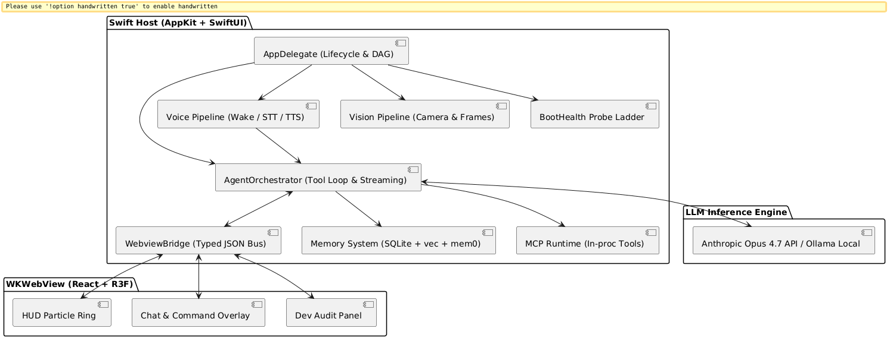
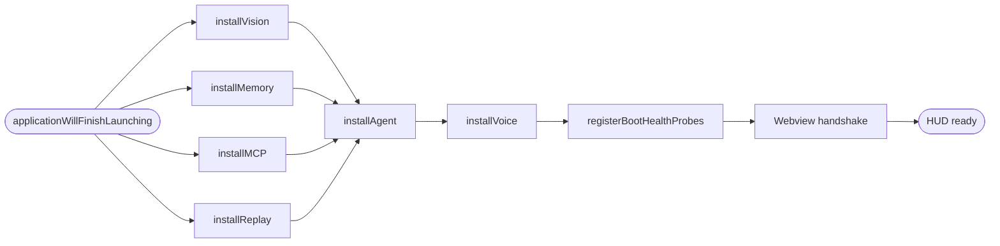
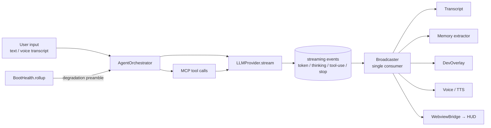
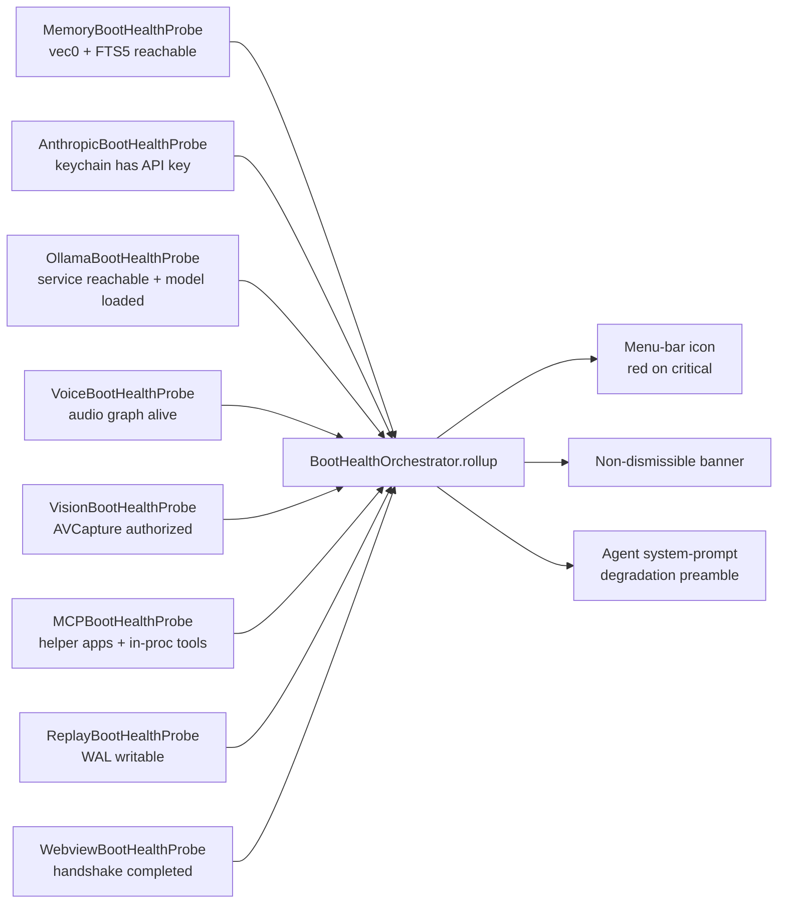

# Jarvis

> A personal, always-on macOS AI assistant in the shape of the Iron Man HUD —
> native Swift brain, R3F particle-ring face, voice-first, locally-grounded.

[](LICENSE)
[](https://github.com/KofTwentyTwo/Jarvis/commits/develop)
[](https://github.com/KofTwentyTwo/Jarvis/issues)
[](https://www.apple.com/macos/)
[](https://swift.org)
[](https://scorecard.dev/viewer/?uri=github.com/KofTwentyTwo/Jarvis)

Jarvis is a hybrid native + embedded-web macOS app that runs as an ambient
menu-bar presence. A Swift host owns the operating system (mic, camera,
clipboard, AppleScript, hotkeys, persistent storage) and an agent loop that
streams **Claude Opus 4.7** with **Ollama** as a first-class local fallback.
A `WKWebView` mounts a React + **React Three Fiber** HUD — a single pulsing
particle ring plus a chat panel — purely as the rendering surface. Tools
ride on **MCP** (Model Context Protocol). Voice (wake-word, STT, TTS) and
memory (SQLite + FTS5 + `sqlite-vec`, mem0-style extraction) are **fully
local**: no cloud TTS/STT, no remote embeddings.

**Scope:** built for one user on one machine — the author. There is no
multi-tenancy, no auth, and no commercial framing. The repo is public so
the code is portable across the author's machines and legible to AI
coding agents; outside readers are welcome to lift the agent loop, typed
JSON Bus, MCP runtime, voice pipeline, R3F HUD scaffold, or the eighteen
boundary-gate linters if useful — but the product is not pitched at a
general audience.

> **Status:** alpha / under active development. `develop` is `0.1.0`. The
> nine GSD phases shipped; the project is now in an audit-and-stabilize
> window plus a v1.0 typed-API migration. See [Roadmap](#roadmap) and
> [GitHub Issues](https://github.com/KofTwentyTwo/Jarvis/issues) for what
> is done versus in flight.

## Screenshots

<!-- TODO:  — record and add separately. -->

Screenshots are TBD — when there is something worth showing, it lands in
[`assets/screenshots/`](assets/screenshots/) per the shot list in that
directory's `README.md`.

- HUD particle ring across the four agent states (idle / listening / thinking / speaking)
- Status panel (menu-bar → *Status…*) with the live boot-health probe set
- Dev Overlay tabs (Turns / Tools / Bus / Logs)
- Non-dismissible degradation banner (critical-severity probe failure)

## Architecture at a glance

A two-process, one-bridge shape: Swift owns truth, the webview is a pure
view, the Bus is the only legal way they talk. Subsystems live in
single-purpose SPM packages; **18 boundary-gate scripts** keep the
isolation honest.



The deep architecture doc is [`ARCHITECTURE.md`](ARCHITECTURE.md) (subsystem
deep-dives, anti-patterns, navigation cheat sheet). The v1.0 typed-API
contract that is currently being migrated to lives at
[`.planning/architecture/JARVIS-API-DESIGN-v0.2.md`](.planning/architecture/JARVIS-API-DESIGN-v0.2.md);
the rollout phases are in
[`.planning/architecture/JARVIS-API-MIGRATION-PLAN.md`](.planning/architecture/JARVIS-API-MIGRATION-PLAN.md).

## Subsystems

Every subsystem is one SPM package under [`packages/`](packages/). The Bus
sits in the middle as the only legal Swift↔JS channel.

| Subsystem | What it does | Package |
|-----------|--------------|---------|
| Agent loop | Claude Opus 4.7 + Ollama via `LLMProvider`; tool-call loop; streaming events to a single broadcaster | [`packages/AgentCore`](packages/AgentCore) |
| Bus | Typed JSON message bus over `WKScriptMessageHandler`; protocol-versioned; harness-parity-checked | [`packages/Bus`](packages/Bus) |
| Voice | openWakeWord (`hey_jarvis`) + Silero VAD v6.2.1 + SpeechAnalyzer STT + AVSpeech / Orpheus TTS | [`packages/Voice`](packages/Voice) |
| Vision | AVCaptureSession camera capture + frame-attach to a turn; T2 presence pipeline deferred | [`packages/Vision`](packages/Vision) |
| Memory | SQLite with FTS5 + `sqlite-vec` (statically linked) + mem0 ADD/UPDATE/NOOP extractor on Qwen 2.5-Coder | [`packages/Memory`](packages/Memory) |
| MCP | Model Context Protocol runtime — separately codesigned helper apps under `Contents/Helpers/` plus in-process tools | [`packages/MCP`](packages/MCP) |
| Replay | Per-turn audit log to a local SQLite — user input, LLM output, tool calls, tool results | [`packages/Replay`](packages/Replay) |
| BootHealth | Eight NOT FAKED probes feeding a strict-mode severity rollup that drives HUD chrome + agent preamble | [`packages/AgentCore`](packages/AgentCore) (`BootHealth*`) |
| HUD | React + R3F particle ring + chat panel + Dev Overlay tabs | [`webview/`](webview) |

Supporting packages: [`Config`](packages/Config), [`DevOverlay`](packages/DevOverlay),
[`Harness`](packages/Harness) (`Mock*`/`Stub*`/`Fake*` doubles per the test naming
convention in `CLAUDE.md`), [`Keychain`](packages/Keychain), [`Logging`](packages/Logging),
[`Shell`](packages/Shell), [`VoiceLog`](packages/VoiceLog).

## Install order

The Swift host installs subsystems in a fixed DAG in
`AppDelegate.applicationWillFinishLaunching`. Order is **load-bearing** —
`packages/AgentCore`'s orchestrator constructor takes the `VisionRouter` (so
Vision installs first), Voice's adapters require the orchestrator and the
turn-transcript store (so Agent installs before Voice). The
[`scripts/check-install-order.sh`](scripts/check-install-order.sh) gate
asserts the spawn-line ordering AND that `voiceInstallTask` awaits
`agentInstallTask?.value` (a strictly stronger guarantee than spawn-order
alone).



## Build & run

Requires **Xcode 16+ on macOS 26 Tahoe (Apple Silicon)**. The Hardened
Runtime needs `com.apple.security.cs.allow-jit` for the WKWebView JIT;
`SpeechAnalyzer` needs `com.apple.developer.speech-recognition-assets`.
Both are wired in `App/Jarvis.entitlements` — do not strip them.

**SPM packages (fast, offline, the default dev loop):**

```bash
swift test --package-path packages/AgentCore
swift test --package-path packages/Bus
swift test --package-path packages/Voice
swift test --package-path packages/Memory
# … one per package; full list in CLAUDE.md → Build / test.
```

Single-test filter: `swift test --package-path packages/<Pkg> --filter <Suite>/<test>`.

**App target** — `swift test` does not compile the App target under Xcode
26 (the xctest harness is upstream-broken on ad-hoc Debug bundles), so use
the wrapper that drives `xcodebuild build -configuration Debug`:

```bash
bash scripts/check-app-builds.sh
```

**Webview (HUD bundle):**

```bash
bash scripts/build-webview.sh
# or, during dev:
cd webview && pnpm install && pnpm --filter @jarvis/hud dev
cd webview && pnpm --filter @jarvis/hud test    # vitest
```

**Boundary gates (18 grep-based architectural invariants — run before pushing):**

```bash
for s in scripts/check-*.sh; do bash "$s" || break; done
```

The gates encode invariants the type system can't — single-writer
`HUDState`, single-consumer orchestrator events, no `evaluateJavaScript`
outside the Bus, vision isolation, presence-bus disallowed in TTS path,
embedding-dim literal pinned, install order, applescript-confirmation,
Bus protocol version + harness parity, no leftover stubs, no modal
presentation, and a handful more.

**Real-hardware / real-network env-flag gates (interactive, opt-in):**

```bash
JARVIS_REAL_MODELS=1 swift test --package-path packages/Memory --filter MemoryRegressionCorpusTests
JARVIS_REAL_CAMERA=1 swift test --package-path packages/Vision --filter CameraCaptureRealHardwareTests
JARVIS_REAL_MODELS=1 swift test --package-path packages/Voice --filter OrpheusTTFATests
```

## Agent turn lifecycle

Every user turn flows through a single broadcaster and fans out to the
subscribers that need it. If a subsystem is degraded, the orchestrator
**injects a system-prompt preamble** so the agent doesn't promise to
remember things the memory store can't actually persist.



## Boot-health probes

Eight probes run on a strict-mode escalation ladder:
`ok → soft → loud → critical`. `.unknown(reason:)` is honest absence; a
probe never returns `.ok` when the dependency is actually broken. Critical
failures turn the menu-bar icon **red**, raise a non-dismissible HUD
banner, and inject the degradation preamble into the agent's system
prompt.



## Project culture

A few opinions, encoded into the codebase as gates and conventions:

- **In-code documentation only.** No sprawling `/docs` that goes stale the
  day after it's written. The code teaches itself or it doesn't get
  taught. The full philosophy lives in
  [`.planning/code-commenting-guide.md`](.planning/code-commenting-guide.md).
  This README is the one exception — it is documentation **of** the
  documentation strategy, which is allowed.
- **NOT FAKED probes.** Every subsystem has a live-probe boot-health
  check. `.unknown(reason:)` is the honest answer when we can't tell;
  `.ok` requires evidence. The audit-and-stabilize discipline came from
  finding too many "wired but dead" subsystems that *looked* installed
  but had no observable signal.
- **Strict-mode escalation.** Soft failures are logged; loud failures
  surface in the Status panel; critical failures take over the chrome and
  the agent's system prompt. The user always knows when Jarvis is
  degraded.
- **18 boundary gates** encode architectural invariants the type system
  can't (single-writer state, isolated subsystems, no rogue
  `evaluateJavaScript`, pinned embedding dim, install order, …).
- **Three-name test-double taxonomy.** `Mock*` records + scripts;
  `Stub*` returns canned data; `Fake*` is a behaviorally-realistic
  alternative implementation. Pick by role, not by sibling.
- **Audit-and-stabilize cadence.** Multi-agent audits land under
  `.planning/audit-YYYY-MM-DD/` (most recent:
  [`audit-2026-05-12`](.planning/audit-2026-05-12/)) and surface
  wired-but-dead bugs as GitHub Issues with severity + area labels.
- **GitHub Issues is canonical.** All bugs, audit findings, and migration
  work live as issues. `docs/TODO.md` is historical only.

## Roadmap

The roadmap is owned by [GitHub Milestones](https://github.com/KofTwentyTwo/Jarvis/milestones)
— user-outcome-focused, not subsystem-focused:

| Milestone | Theme |
|-----------|-------|
| **v0.1** — *It actually works* | Closes the CRITICAL audit findings that break basic capabilities (voice, vision, facts, dialogs). Some get re-fixed during the API migration; v0.1 ships working NOW. |
| **v0.2** — *Observable + stable* | Everything CRITICAL/HIGH from the 2026-05-12 audits that isn't a basic-capability blocker; tightens the observability surface; closes wired-but-dead gaps. |
| **v0.5** — *API M-0..M-3* | Scaffold `JarvisAPI` package, dual-version Bus handshake, then land Self / Settings / Diagnostics typed surfaces. HUD state moves to Diagnostics. |
| **v0.8** — *API M-4..M-7* | Memory / Vision / Voice / Turn typed surfaces. Per-turn `OutboundBatcher` partitioning. Webview retires the `sessionHistory` push. Bus protocol bumps to 2.4.0 strict after a 3-day soak. |
| **v1.0** — *Shipping* | Code-commenting style applied to load-bearing files. Stale plan-id gate. Doc reconciliation. First-launch experience polish. |
| **v1.1** — *Backlog* | Orpheus TTS tier 2 activation. WhisperKit STT fallback. Voice Log menu. Vision T2 sidecar. Presence pipeline. Advanced polish. |

Day-to-day session handoff still lives in
[`docs/SESSION-STATE.md`](docs/SESSION-STATE.md); milestone-level state in
[`.planning/STATE.md`](.planning/STATE.md). Per-phase artifacts under
[`.planning/phases/<N>/`](.planning/phases/).

## Repository layout

| Path | Purpose |
|------|---------|
| [`App/`](App) | Swift host — `AppDelegate`, MenuBar, HUD window, Settings, Wizard, MCP runtime wiring |
| [`packages/`](packages) | 14 Swift packages (SPM) — one per subsystem |
| [`webview/`](webview) | pnpm workspace — `@jarvis/bus` (TS mirror of the Swift Bus) + `@jarvis/hud` (R3F bundle) |
| [`mcp-servers/`](mcp-servers) | Out-of-process MCP helper apps — `mcp-time`, `mcp-clipboard`, `mcp-applescript` |
| [`scripts/`](scripts) | Build/codesign scripts and the 18 boundary-gate linters |
| [`Resources/`](Resources) | Bundled assets — voice ONNX models, HUD bundle target, app icon source |
| [`docs/`](docs) | Live cross-session state — `SESSION-STATE.md`, archived `TODO.md` |
| [`.planning/`](.planning) | GSD workflow artifacts — phase plans, audit reports, research syntheses, architecture |
| [`assets/`](assets) | Screenshots + diagrams (populated opportunistically) |

## Key documents

- [`ARCHITECTURE.md`](ARCHITECTURE.md) — deep architecture doc
- [`CONTRIBUTING.md`](CONTRIBUTING.md) — dev environment setup, GSD workflow, commit conventions
- [`CLAUDE.md`](CLAUDE.md) — settled architectural decisions, AI-agent collaboration conventions, issue-tracking policy
- [`.planning/code-commenting-guide.md`](.planning/code-commenting-guide.md) — the in-code documentation philosophy
- [`.planning/architecture/JARVIS-API-DESIGN-v0.2.md`](.planning/architecture/JARVIS-API-DESIGN-v0.2.md) — v1.0 typed-API contract (locked)
- [`.planning/architecture/JARVIS-API-MIGRATION-PLAN.md`](.planning/architecture/JARVIS-API-MIGRATION-PLAN.md) — M-0..M-7 rollout
- [`docs/SESSION-STATE.md`](docs/SESSION-STATE.md) — current session state

## Contributing

This is a solo project. If you've stumbled across it and want to discuss
something, the welcoming move is to
[open a GitHub issue](https://github.com/KofTwentyTwo/Jarvis/issues/new).
Style, commit conventions, and the GSD workflow live in
[`CONTRIBUTING.md`](CONTRIBUTING.md).

## License

Jarvis is released under the [MIT License](LICENSE). See
[`.planning/decisions/license.md`](.planning/decisions/license.md) for
the rationale (solo personal project; no patent strategy or SaaS
surface to protect; MIT considered against Apache-2.0 / MPL-2.0 /
AGPL-3.0 and chosen for minimum friction).

## Acknowledgments

Jarvis stands on a stack of excellent open-source work. The most
load-bearing dependencies:

**LLM + agents**
- [Anthropic Messages API](https://docs.anthropic.com/) — Claude Opus 4.7 as
  the primary reasoning model.
- [Ollama](https://ollama.ai) — local LLM runtime; Qwen 2.5-Coder for tool-
  calling, `nomic-embed-text` for memory embeddings.
- [Model Context Protocol Swift SDK](https://github.com/modelcontextprotocol/swift-sdk)
  — typed `Client` / `Server` / `StdioTransport` so we don't roll our own
  JSON-RPC framing.

**Voice (fully local)**
- [openWakeWord](https://github.com/dscripka/openWakeWord) — `hey_jarvis`
  pretrained model running through ONNX Runtime.
- [Silero VAD](https://github.com/snakers4/silero-vad) v6.2.1 — voice
  activity detection.
- [`onnxruntime-swift-package-manager`](https://github.com/microsoft/onnxruntime-swift-package-manager)
  — wake-word + VAD inference in-process.
- [`argmax-oss-swift`](https://github.com/argmaxinc/argmax-oss-swift) —
  WhisperKit STT fallback + TTSKit streaming alternative.
- [`mlx-audio-swift`](https://github.com/Blaizzy/mlx-audio-swift) — Orpheus
  TTS via MLX, no Python sidecar.

**Memory**
- [SQLite](https://sqlite.org) + [FTS5](https://www.sqlite.org/fts5.html) —
  keyword search and the canonical store.
- [`sqlite-vec`](https://github.com/asg017/sqlite-vec) (via `sqlitevec`
  SPM) — statically-linked vec0 vector extension.

**HUD**
- [React Three Fiber](https://r3f.docs.pmnd.rs/) + [Three.js](https://threejs.org/)
  — particle ring, holographic chrome, agent-state-reactive shaders.
- [pnpm](https://pnpm.io) + [Vite](https://vitejs.dev) — webview workspace
  + bundle.

**Swift platform**
- [`swift-log`](https://github.com/apple/swift-log) — structured logging
  feeding the Dev Overlay's Logs tab.
- [`swift-nio`](https://github.com/apple/swift-nio) — async networking
  primitives under MCP and HTTP providers.
- [`yams`](https://github.com/jpsim/Yams) — YAML config parsing.

The full dependency graph lives in each package's `Package.resolved`.
